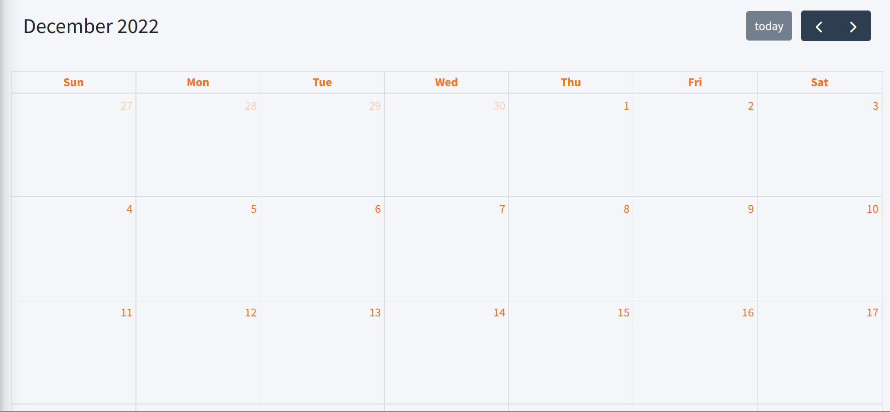

# Laravel 10 Full Calendar Helper

This is a simple helper package to make generating [http://fullcalendar.io](http://fullcalendar.io) in Laravel apps easier.

## Installing
Require the package with composer using the following command:

    composer require meunee/laravel-fullcalendar

Or add the following to your composer.json's require section and `composer update`

```json
"require": {
	"meunee/laravel-fullcalendar": "~1.0.0"
}
```
The provider and `Calendar` alias will be registered automatically.

You won't need to include [fullcalendar.io](http://fullcalendar.io/)'s files in your HTML, version 6.0.2 is included in this package.


## Usage

### Creating Events

#### Using `event()`:
The simpliest way to create an event is to pass the event information to `Calendar::event()`:


```php
$event = \Calendar::event(
    "Valentine's Day", //event title
    true, //full day event?
    '2015-02-14', //start time, must be a DateTime object or valid DateTime format (http://bit.ly/1z7QWbg)
    '2015-02-14', //end time, must be a DateTime object or valid DateTime format (http://bit.ly/1z7QWbg),
	1, //optional event ID
	[
		'url' => 'http://full-calendar.io'
	]
);
```
#### Implementing `Event` Interface

Alternatively, you can use an existing class and have it implement `Meunee\LaravelFullcalendar\Event`. An example of an Eloquent model that implements the `Event` interface:

```php
class EventModel extends Eloquent implements \Meunee\LaravelFullcalendar\Event
{

    protected $dates = ['start', 'end'];

    /**
     * Get the event's id number
     *
     * @return int
     */
    public function getId() {
		return $this->id;
	}

    /**
     * Get the event's title
     *
     * @return string
     */
    public function getTitle()
    {
        return $this->title;
    }

    /**
     * Is it an all day event?
     *
     * @return bool
     */
    public function isAllDay()
    {
        return (bool)$this->all_day;
    }

    /**
     * Get the start time
     *
     * @return DateTime
     */
    public function getStart()
    {
        return $this->start;
    }

    /**
     * Get the end time
     *
     * @return DateTime
     */
    public function getEnd()
    {
        return $this->end;
    }
}
```

#### `IdentifiableEvent` Interface

If you wish for your existing class to have event IDs, implement `\Meunee\LaravelFullcalendar\IdentifiableEvent` instead. This interface extends `\Meunee\LaravelFullcalendar\Event` to add a `getId()` method:

```php
class EventModel extends Eloquent implements \Meunee\LaravelFullcalendar\IdentifiableEvent
{

	// Implement all Event methods ...

    /**
     * Get the event's ID
     *
     * @return int|string|null
     */
    public function getId();

}

```

### Additional Event Parameters

If you want to add [additional parameters](http://fullcalendar.io/docs/event_data/Event_Object) to your events, there are two options:

#### Using `Calendar::event()`

Pass an array of `'parameter' => 'value'` pairs as the 6th parameter to `Calendar::event()`:

```php
$event = \Calendar::event(
    "Valentine's Day", //event title
    true, //full day event?
    '2015-02-14', //start time, must be a DateTime object or valid DateTime format (http://bit.ly/1z7QWbg)
    '2015-02-14', //end time, must be a DateTime object or valid DateTime format (http://bit.ly/1z7QWbg),
	1, //optional event ID
	[
		'url' => 'http://full-calendar.io',
		//any other full-calendar supported parameters
	]
);

```

#### Add an `getEventOptions` method to your event class

```php
<?php
class CalendarEvent extends \Illuminate\Database\Eloquent\Model implements \Meunee\LaravelFullcalendar\Event
{
	//...

	/**
     * Optional FullCalendar.io settings for this event
     *
     * @return array
     */
    public function getEventOptions()
    {
        return [
            'color' => $this->background_color,
			//etc
        ];
    }

	//...
}

```

### Create a Calendar
To create a calendar, in your route or controller, create your event(s), then pass them to `Calendar::addEvent()` or `Calendar::addEvents()` (to add an array of events). `addEvent()` and `addEvents()` can be used fluently (chained together). Their second parameter accepts an array of valid [FullCalendar Event Object parameters](http://fullcalendar.io/docs/event_data/Event_Object/).

#### Sample Controller code:

```php
$events = [];

$events[] = \Calendar::event(
    'Event One', //event title
    false, //full day event?
    '2015-02-11T0800', //start time (you can also use Carbon instead of DateTime)
    '2015-02-12T0800', //end time (you can also use Carbon instead of DateTime)
	0 //optionally, you can specify an event ID
);

$events[] = \Calendar::event(
    "Valentine's Day", //event title
    true, //full day event?
    new \DateTime('2015-02-14'), //start time (you can also use Carbon instead of DateTime)
    new \DateTime('2015-02-14'), //end time (you can also use Carbon instead of DateTime)
	'stringEventId' //optionally, you can specify an event ID
);

$eloquentEvent = EventModel::first(); //EventModel implements Meunee\LaravelFullcalendar\Event

$calendar = \Calendar::addEvents($events) //add an array with addEvents
    ->addEvent($eloquentEvent, [ //set custom color fo this event
        'color' => '#800',
    ])->setOptions([ //set fullcalendar options
		'firstDay' => 1
	])->setCallbacks([ //set fullcalendar callback options (will not be JSON encoded)
        'viewRender' => 'function() {alert("Callbacks!");}'
    ]);

return view('hello', compact('calendar'));
```


#### Sample View

Then to display, add the following code to your View:

```html
<!doctype html>
<html lang="en">
<body>
    {!! $calendar->calendar() !!}
    {!! $calendar->script() !!}
</body>
</html>
```
**Note:** The output from `calendar()` and `script()` must be non-escaped, so use `{!!` and `!!}` (or whatever you've configured your Blade compiler's raw tag directives as).   

The `script()` can be placed anywhere after `calendar()`, and must be after fullcalendar was included.

This will generate (in February 2022):


